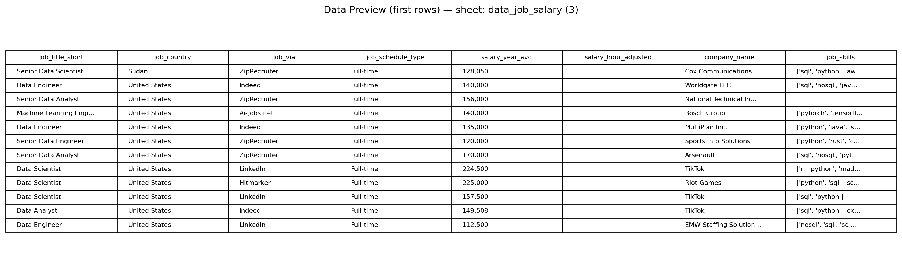
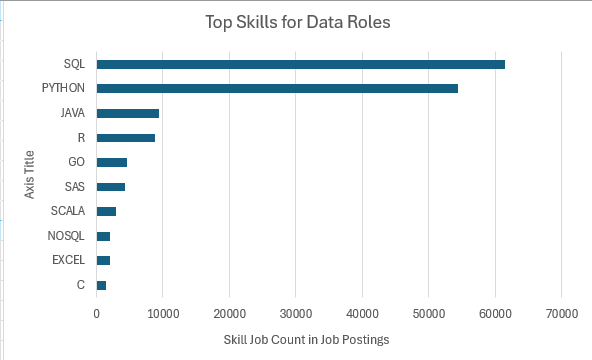
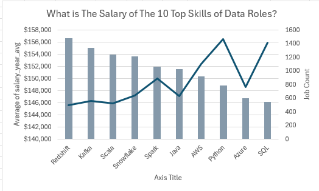
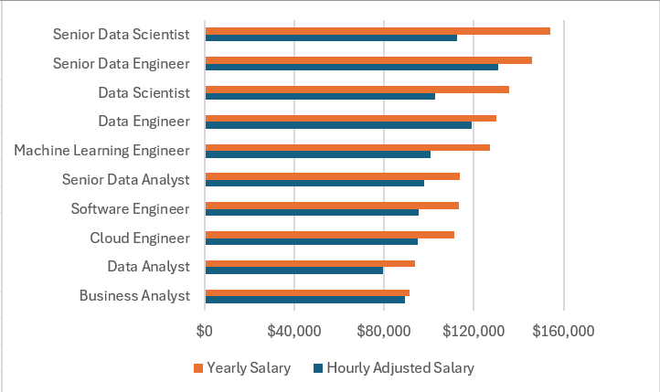
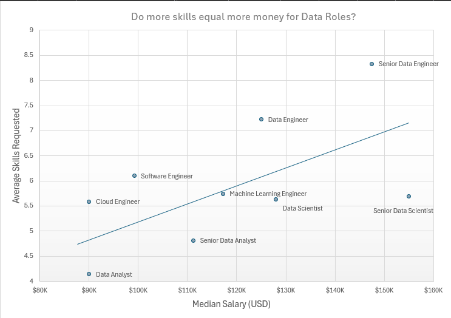

# Data Roles Analytics (Excel Workbook)

This project contains an Excel workbook that analyzes **data-related job roles, salaries, and in-demand skills** using a job‑posting dataset. It is designed as a portfolio artifact to demonstrate practical Excel analytics skills: structuring a dataset, summarizing it with pivots, and communicating insights through clear visuals.

**Author:** Othman Alabed  
**Purpose:** Created after completing an Excel Data Analytics course to showcase my competence in Excel for data analytics and dashboard-style reporting.

---

## Files

- `Data Roles Analytics.xlsx` — the Excel workbook (data + analysis sheets)
- `screenshots/` — images embedded in this README

---

## How to use

1. Open `Data Roles Analytics.xlsx` in **Microsoft Excel (desktop recommended)**.
2. If prompted, click **Enable Editing**.
3. If you update the dataset, use **Data → Refresh All** to refresh pivots/charts.

---

## Sheet-by-sheet guide

### 1) `data_job_salary (3)` — Source dataset

This sheet contains the raw job-posting data used by all analysis sheets. Each row represents a posting, with fields such as:

- `job_title_short`, `job_title`
- `job_country`, `job_location`, `search_location`
- `job_via` (posting source/platform), `job_schedule_type`, `company_name`
- Salary fields: `salary_year_avg`, `salary_hour_avg`, `salary_hour_adjusted`
- `job_skills` (skills requested in the posting)
- Other flags: `job_work_from_home`, `job_no_degree_mention`, `job_health_insurance`

---

### 2) `Skill job Analysis` — Most requested skills

This sheet summarizes **how frequently specific skills appear in job postings**. It is built as a pivot-style summary that counts occurrences of each skill within the dataset and feeds the bar chart.

**Chart:** *Top Skills for Data Roles* (job count by skill)

**Interpretation (example):**
- Skills like **SQL** and **Python** appear most frequently across postings, indicating strong baseline demand.

---

### 3) `Salary of Top Skills` — Salary vs demand for top skills

This sheet compares:
- **Average annual salary** associated with each of the selected top skills, and
- **Job count** (demand) for those skills

It is useful for viewing the trade-off between *how common* a skill is and *how well it tends to pay* in the available postings.

**Chart:** *What is the Salary of the 10 Top Skills of Data Roles?*  
- Bars = **Average salary_year_avg**  
- Line = **Job Count**

---

### 4) `Salary for Data Roles` — Salary comparison by role

This sheet compares compensation across common data roles using two measures:
- **Yearly Salary** (from annual salary values)
- **Hourly Adjusted Salary** (hourly compensation standardized into a comparable annualized figure using the dataset’s `salary_hour_adjusted` field)

**Chart:** Role comparison with two salary measures (yearly vs hourly-adjusted)

**Interpretation (example):**
- Senior roles (e.g., **Senior Data Scientist / Senior Data Engineer**) rank higher on both salary measures compared with entry-level roles.

---

### 5) `Skills Per Job` — Do more skills relate to higher pay?

This sheet examines whether roles that request **more skills per posting** also show higher **median salary**.

Key fields in the summary table:
- **Skill Count** = total number of skill mentions for that role
- **Job Count** = number of postings for that role
- **Skills Per Job** = average skills requested per posting (Skill Count / Job Count)
- **Median Salary** = median of `salary_year_avg` for that role

**Chart:** *Do more skills equal more money for Data Roles?*  
Scatter plot of **Median Salary vs Average Skills Requested**, including a trendline.

**How to read it:**
- Each point is a role (e.g., Data Engineer, Data Analyst).
- The trendline provides a quick view of the overall relationship between “skills requested” and “pay” in this dataset.

---

## Notes

- Results depend on the completeness of salary fields in the dataset.
- This workbook is a learning/portfolio project and is intended for educational and demonstration purposes.

---

## Author

**Othman Alabed**  
Excel Data Analytics Portfolio Project
